# Songbook

One icon in the Omarchy bar and one card behind it: your music folders, radio
from anywhere in the world, YouTube, your audiobooks, and your novels — read
aloud by an offline voice, or read yourself in a terminal reader. Everything
plays through MPD.

> Songbook used to be called `rushi.rmpc`. It is not [rmpc][rmpc], the terminal
> MPD client — that is someone else's program, which this card can launch on a
> right click.

[rmpc]: https://github.com/mierak/rmpc

<p align="center">
  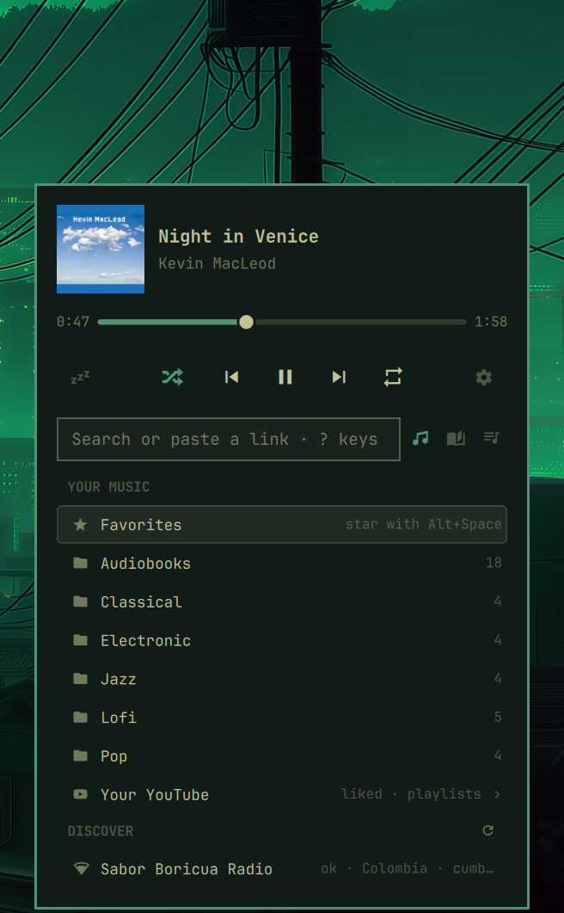
  &nbsp;
  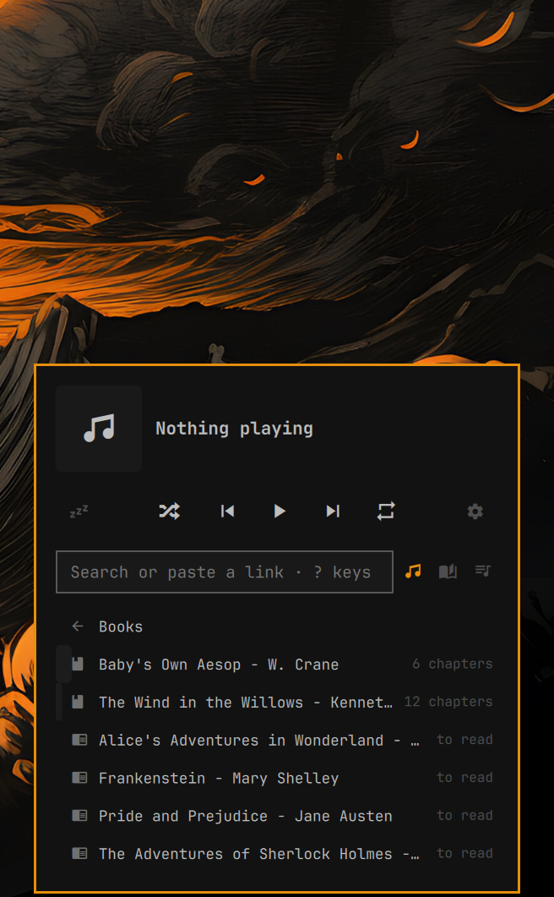
</p>

<p align="center">
  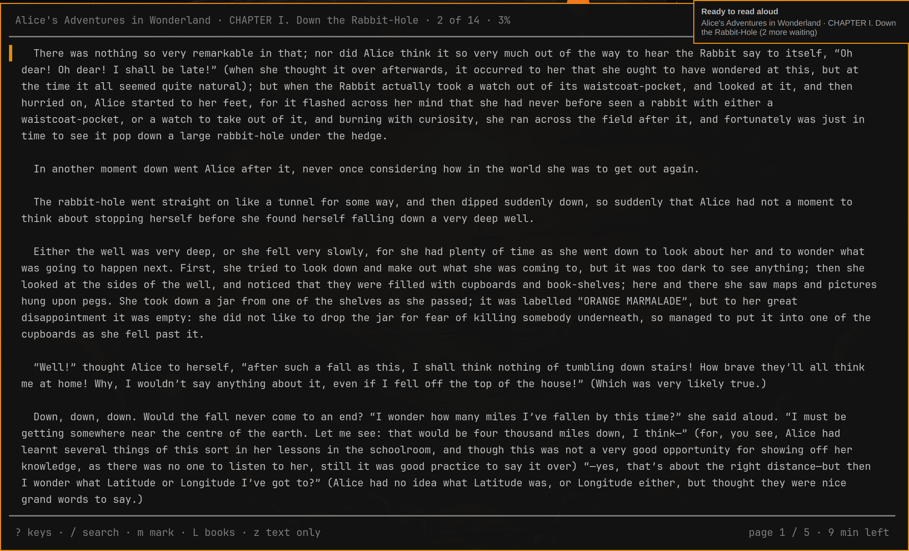
</p>

## Install

Needs Omarchy with the Quattro shell, a running MPD, and:

```bash
sudo pacman -S --needed mpd python yt-dlp ffmpeg   # rmpc is optional (right click)
systemctl --user enable --now mpd
```

Then add the plugin and put it on the bar:

```bash
omarchy plugin add https://github.com/RushiSompuraWork/Songbook --enable
```

The card finds MPD, your music folder and the visualizer FIFO by reading
`~/.config/mpd/mpd.conf` (or `$MPD_CONF`). `MPD_HOST` / `MPD_PORT` work as they
do for mpc and rmpc, including a socket path. For the dancer to follow the
beat, MPD needs a FIFO output, for example:

```
audio_output {
    type   "fifo"
    name   "Visualizer feed"
    path   "/tmp/mpd.fifo"
    format "44100:16:2"
}
```

Without it everything works and the dancer just sways on a timer.

The dancer is off by default (Settings → Dancer on the bar). The card turns
MPD's feed output on only while a dancer is on screen and off otherwise
(MPD's `enableoutput` / `disableoutput`, no restart, no gap in the music):
left on, the feed costs MPD about as much again as playing (measured: 0.37%
of a core without it, 0.83% with it). If another program reads the same
fifo (a visualizer), give it its own `audio_output` of a different type.
`scripts/card.py config` prints what it found.

## Remove

```bash
omarchy plugin remove rushi.songbook
rm -rf ~/.local/state/rushi.songbook ~/.cache/rushi.songbook   # stars, resume point, art cache
```

Music you downloaded stays in your music folder, and the `Favorites` MPD
playlist stays in MPD's playlist folder; delete them yourself if you want.

## The bar

One icon, no text. A record (󰦚) for music and YouTube, a radio tower (󰐹) for a
station, dimmed when nothing plays. Hover for the title.

- Left click: open the card
- Middle click: play/pause (resumes the last thing played if the queue is empty)
- Right click: open the `rmpc` TUI
- Scroll: previous/next

`omarchy-shell songbook toggle` opens the card too, if you want a keybinding;
`omarchy-shell songbook help` opens it on the shortcut guide, and
`omarchy-shell songbook art` does what clicking the art square does, and
`omarchy-shell songbook view home|lyrics|queue|settings|inbox` opens the card on that view.

## The card

<p align="center">
  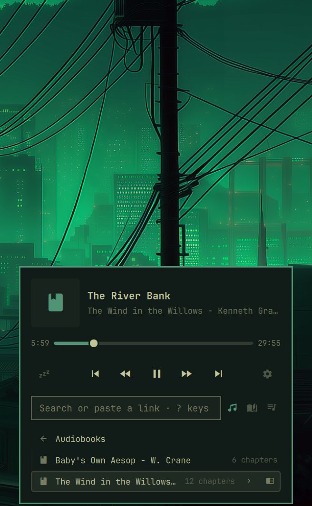
  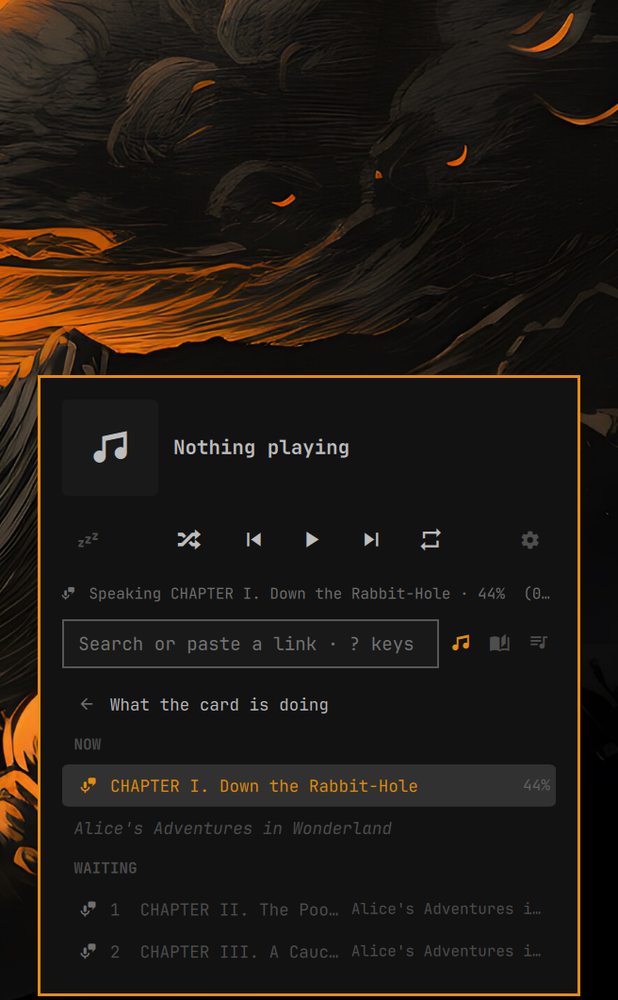
</p>

Now playing, the playback buttons with **☾ sleep** at the left and **⚙
settings** at the right, one search box with the view icons beside it, and
one list below.

- **Views**: ♫ Library, ❝ Lyrics and ≡ Up next, picked with the icons
  beside the search box.
- **Songs play alone**: clicking a song (in a folder, a search or
  Favorites) plays just that song; + on hover (Ctrl+Enter) adds one to the
  end of Up next, Shift+Enter or a middle click adds it to play next.
  Clicking the folder row itself plays the whole folder.
- **Up next** shows the playing song and what follows; hover a row for
  ↑ ↓ ✕, or Alt+↑/↓ and Delete. The clear icon in its header (Ctrl+Delete)
  removes everything after the playing song in one click.
- **Lyrics**: synced lyrics from [LRCLIB](https://lrclib.net) that follow the
  song, the current line highlighted and kept in view; click a line to jump
  there. Radio gets plain lyrics looked up by the song name the station
  sends. Fetched and cached by `scripts/extras.py`, never by the shell.
- **Import songs** (the first row in Settings): brings in what is new
  in `~/Downloads` (from the last two weeks); ↻ at its top looks again. "How importing works" at its top (or the
  view itself, when empty) explains the steps:
  - **song lists** (CSV, TXT, M3U): exported from Spotify with
    [Exportify](https://github.com/watsonbox/exportify), from YouTube with
    Google Takeout, or from almost anywhere with
    [TuneMyMusic](https://www.tunemymusic.com). Open one, untick what you
    don't want, then **Play** or **Download into a folder**. Each song is
    found on YouTube (or taken from its link), one every six seconds so
    YouTube does not block you. While it runs, progress shows at the top of
    the Library, with ✕ to stop.
  - **music files**, including anything sent from a phone with LocalSend:
    move one or all into a folder. Nothing is ever overwritten.
  - ✕ on a row hides it from the Inbox; the file stays where it is.
  - A pasted **YouTube playlist link** also gets "save all to a folder".
- **First open**: a four-tip tour (Skip, or Esc, ends it for good; Settings
  can show it again), and a setup check that lists anything missing (MPD not
  running, no music folder, no yt-dlp or ffmpeg) with how to fix it.
- **Audiobooks** live in the music folder like any other folder; the card
  opens one it recognises as a book (󰂺). It is sure of an `.m4b` (its
  chapters come from inside the file, read with ffprobe) and of every folder
  inside the **Book folders** chosen in Settings → Library → Audiobooks (any
  number, at any depth), and guesses the rest: a genre tag of Audiobook or
  Speech, or every file at least "Counts as a book from" long (10 minutes
  unless changed; typed in whole minutes) and numbered. Any file that long,
  and any `.m4b`, also plays book-style on its own and keeps its place.
  A Book folder holding several books (novels, audiobook folders) is a
  shelf (󱉟): clicking it opens it instead of playing it, and each .epub
  or .txt inside shows as its own book (click opens the reader).
  A song picked from inside a book's folder starts the book at that
  chapter (the whole folder queued in order), not just that one song. Click a book: it
  carries on where it was left. › lists the chapters: heard ones are gray,
  each remembers where it stopped (going back starts it there), and 󰑓 marks
  one as not heard again. Settings → Library → Audiobooks: a chapter counts
  as heard after 30 s, 1 min (default) or when finished, and skipped
  chapters can gray out too (off). Chapters play in order (MPD random off).
  Progress is kept in `~/.local/state/rushi.songbook/library.json`, one record
  per book: what was heard of each chapter, where reading stopped, and when.
  A book is known by what it is (an audiobook by its files' names and
  lengths, a novel by its bytes), so moving or renaming a folder keeps its
  progress; chapters are stored by file name, never by folder.
  Next and previous move by chapter, also inside one `.m4b` (MPD's own
  next would end the book), each chapter where it was left. While a book
  plays, the title is the chapter and the artist the book; inside one
  `.m4b` the time bar is the chapter's, not the whole file's.
<p align="center">
  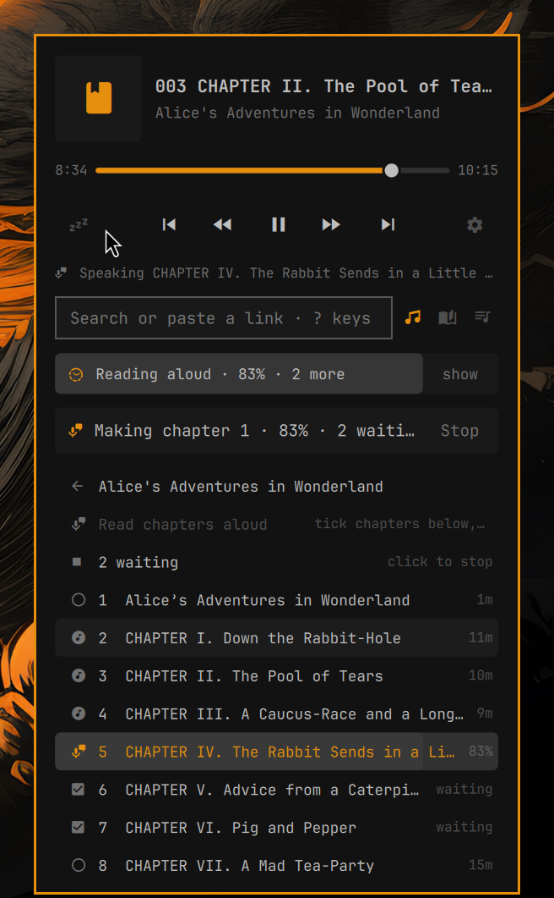
  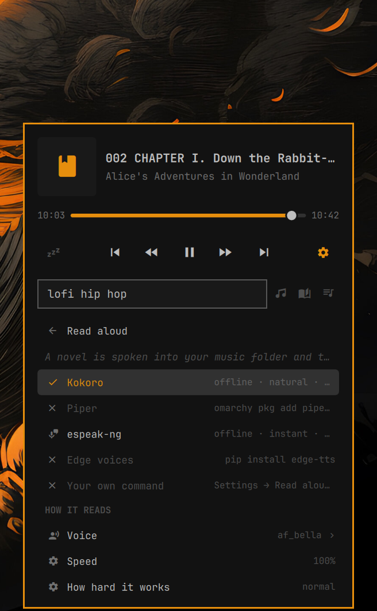
</p>

- **Reading a novel aloud** (`scripts/voices.py`, `scripts/speak.py`): press
  p on a novel in the reader. Its chapter is spoken sentence by sentence by
  whichever engine is installed, joined into one MP3 with a timed `.lrc`
  beside it, in `Spoken/<book>` inside the music folder. That folder is then
  an ordinary audiobook: the card plays it, rmpc sees it, the media keys and
  the sleep timer work, and the reader lights up the sentence being spoken.
  The next chapters are made while this one plays (Settings → Read aloud →
  Chapters made ahead). Engines: **Kokoro** (offline, natural), **Piper**
  (offline, quick), **espeak-ng** (offline, robotic), **Edge voices** (sent
  over the internet), **your own command** (`{text} {out} {voice} {speed}`,
  the text in a file, never a shell) and a test hum. None is installed by the
  card, and the test hum is hidden there (it is not a voice). Settings →
  Read aloud lists the real engines and how to get each: 󰇚 puts **Kokoro**
  in place by itself (its own Python under
  `~/.local/share/rushi.songbook/voices`, about 2 GB, no root), and 󰆏 copies the
  command for the others.
  Timings work with every engine: each sentence's audio is measured, and an
  engine that reports its own word times gives the finer highlight. An
  engine that loads a model speaks a batch in one run (Kokoro: 20 sentences,
  because loading costs about 5 s and a sentence half a second). Each spoken
  chapter records the engine, voice and speed that made it, so changing
  voice makes it again rather than keeping the old one. The spoken folder
  always counts as a book, however short its chapters. Only one chapter is
  spoken at a time (a lock): pressing p again says what is already being
  spoken instead of starting a second job. How far it has got shows in the
  card's status line and at the bottom of the reader, and Settings → Read
  aloud can stop it.
- **The reader** (`scripts/reader.py`): a terminal app in rmpc's way for
  novels and audiobooks. Only the text in the middle, in the terminal's own
  colours (so the Omarchy theme applies); a dim line at the top (book ·
  chapter · %) and at the bottom (keys, or ⏵ time / length, a progress bar
  and minutes left while the book plays). While an audiobook with text plays,
  the sentence being spoken shows in reverse (or the word, or the paragraph),
  and the text follows it; scroll away and `.` brings it back. Opens EPUB
  and TXT (chapters from the book's contents, or "Chapter …" lines), and
  book folders. Keys: ↑↓ j k scroll, space f / b page, g G, [ ] chapter,
  p play or pause the book, ← → back / ahead while listening (pages when
  reading), / search the whole book (enter jumps to a hit), m bookmark (type
  a note, or Esc), B the bookmarks (enter goes there, n note, d delete),
  C chapters, A text: width (40 to 180 columns, or the full
  window), line height (1.0, 1.2, 1.5, 1.7, 2.0: set in foot when the window
  opens, so the window reopens on closing the panel; other terminals keep
  their own), paragraph gap, first-line indent, justify, scroll or pages,
  what lights up, and animation (a page turn slides the old page out to the
  left and the new one in from the right; in the scroll layout a page down
  scrolls smoothly; or none). The defaults are his choice: width 140, line
  height 1.2, 1-line paragraphs, indent 2, justified, pages, sentence,
  slide. Text settings are one set for every book. Zooming the window
  (Ctrl + / Ctrl − in foot) is remembered too: the reader reads the cell
  size foot reports, and the next window, for any book, opens at that font
  size. + − width, z text only (nothing but the words), L books,
  ? keys, Esc closes a panel. L is the books: each with a progress bar, /
  search, s sort (recent, title, progress), f show (all, reading, finished,
  not started), and the time read today, this week and the day streak. The
  top line says which chapter of how many and how far through the book;
  the bottom line the minutes left. The reader closes like any window (Super +
  W); no key closes it, and the place is saved as it closes. It keeps each book's place. Open it with 󰂽 on a book row
  (read along), "Read along" on a book's page, 󰊓 in Lyrics while a book
  plays, a novel in a Book folder (click), or `omarchy-shell songbook reader`.
  It runs in a terminal as `songbook.reader` (omarchy-launch-or-focus-tui);
  the book to open travels in `reader-open.json`, since book names have
  spaces. Text size is the terminal's own zoom.
- **Click the name of what plays** to go where it lives, with its row
  picked out: a song's folder, a book's chapters, the station list it was
  started from (a genre, a country, Starred, Discover); YouTube opens Up
  next. `omarchy-shell songbook playing` does the same.
- **Audiobook controls**: while a book plays the buttons are chapter back,
  󰑟 back (10, 15 or 30 s), play, 󰈑 ahead (30 or 10 s), chapter ahead. A book resumed
  after a pause of 5 minutes or more goes back 10 s (5, 30 or off) to pick
  up the thread. The sleep timer's "after this song" becomes "end of this
  chapter", also inside one `.m4b`, and the sleep timer fades out over 10 s
  (Settings → Playback; with the fade on, a chapter-end sleep starts it
  10 s early so the sound is gone as the chapter ends).
  `omarchy-shell songbook sleep` steps the sleep timer, for a key binding.
<p align="center">
  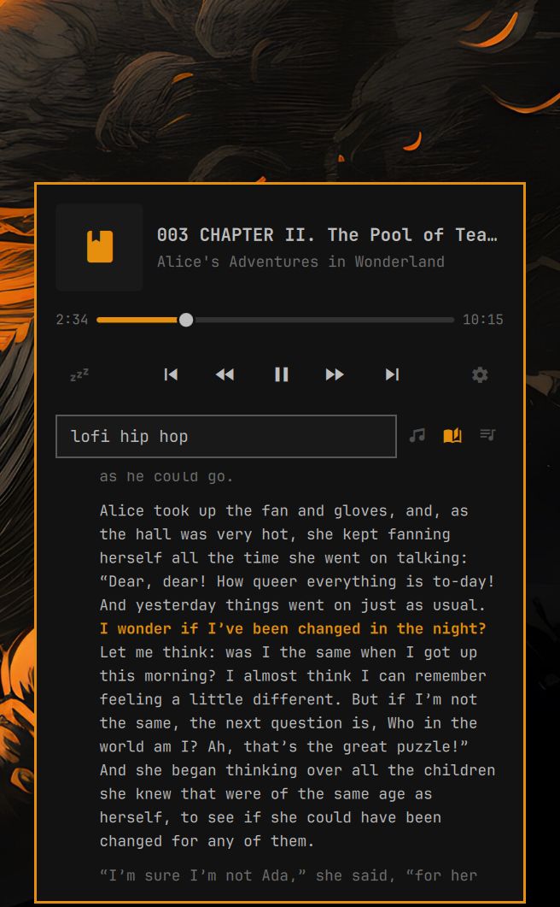
  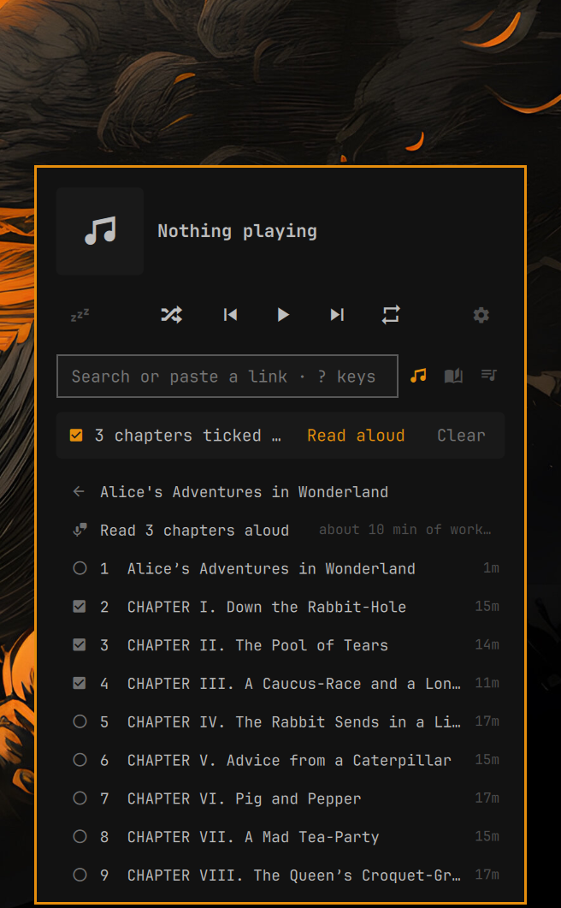
</p>

- **Reading along** (the Lyrics view, ♪): a book's text, or a song's own
  words kept beside it, shows while it plays, as paragraphs. Sources, first
  found wins: a file beside the audio with the same name (`.lrc`, also with
  a time on every word; `.srt`; `.vtt`, also with word times; `.txt`, not
  timed; `chapter01.en.srt` counts too), lyrics in the file's own tags, or
  an EPUB 3 with Media Overlays (the read-along standard; Storyteller and
  syncabook make them) in the same folder. For one `.m4b`, one file covers
  the book; the card shows the chapter playing. Settings → Lyrics → "A book
  lights up": the sentence (default), each word, or the paragraph. Click a
  paragraph to jump there. A book never asks the online lyrics service. The
  words are always shown as text: a file cannot add links or pictures.
  Parsed text is kept in `~/.cache/rushi.songbook/text`.
- **Icons say what is playing**: the cover when there is one (embedded, a
  `cover.jpg` in the folder, or YouTube's thumbnail); otherwise, in the art
  square, on the bar and in Up next: 󰝚 music, 󰐹 radio, 󰗃 YouTube, 󰂺 a book.
- **Problems can be copied**: an error under the buttons (it stays 15 s and
  wraps, so all of it can be read), a failed download (with yt-dlp's reason)
  and an error inside a list all have a copy icon (󰆏). It puts the whole
  message on the clipboard, starting "rushi.songbook (Omarchy music card):", to
  search online or give to an AI.
- **Sleep**: one icon; each click moves it on: off, 15, 30, 60 minutes,
  after this song (MPD's single-oneshot), off. Hover shows the time left.
- **Settings** is a list of sections, each with a one-line summary of what
  is set inside: Import songs, Playback, Library, Radio, YouTube, Lyrics,
  Bar and notifications, Privacy and data, Shortcuts, Help and reset.
  - **Playback**: fade between songs, pause on headphone unplug, remove
    songs from Up next once played (MPD consume), shuffle a folder when it
    starts (the song clicked still plays first), soft pause (MPD's own
    volume fades out over 0.4 s before a pause and in over 0.6 s on play;
    the volume it had is written down first, so a fade cut short is put
    right on the next one), and the sleep timer fading out. Long files
    always carry on where they stopped (as long as Audiobooks → "Counts as a
    book from": the watcher notes the place every 30 s and on pause, and
    seeks there when the file starts again; forgotten once it is within a
    minute of the end).
  - **Library**: music folder, look for new songs now, sort folders (by
    name, or last played first), hide folders from the home page (they still
    play from search), and for downloads: one folder they always go into, or
    ask each time;
    format (MP3, or Opus exactly as YouTube sends it: smaller than best MP3,
    no re-encoding; it gets a cover only with `python-mutagen` installed),
    MP3 quality (best, or about 40% smaller), and cutting talk and intros
    that SponsorBlock marks as not music.
  - **Radio**: how long lists and speed tests are kept, test now, hide
    not-working (or slow too) stations, prefer higher bitrate among stations
    as fast, countries Discover leans towards (up to ten; two of its three
    picks come from them when they play well), genres shown on the World
    page, and starred stations out to `~/Downloads/radio-stars.m3u` or in
    from any `.m3u` there (web addresses only, names cut short, 500 at most).
  - **YouTube**: sign-in, steady playback, streaming quality (best, or data
    saver: about 70 kbps at most), results per search (6, 10, 15), and
    searching YouTube Music (songs only, no covers or talk). Once signed in,
    **Your YouTube** on the home page lists Liked videos and your playlists.
  - **Lyrics**: open the card on the lyrics while a song plays, timing
    (lines up to 1 s earlier or later), text size.
  - **Bar and notifications**: the dancer, its style (one always, or a new
    one each song), a short song title beside the icon (still, cut at 24
    characters: it redraws only when the song changes), song notifications
    and what they show (cover, title and artist; no cover; title only),
    middle and right click.
  - **Privacy and data**: whether Radio Browser is told a station was played,
    and clearing saved covers, lyrics, radio lists and speed tests (settings,
    stars and Favorites are kept).
  Inside, in short: the dancer on the bar (off by default), fade between songs
  (off, 3, 6, 10 s), a notification when the song changes (off; only while
  the card is closed), pause when headphones unplug (on; watches PipeWire
  with `pactl subscribe`), YouTube sign-in (off), steady YouTube playback
  (on), the music folder, a setup check, and shortcuts.
- **YouTube sign-in**: pick a browser you are already signed in to YouTube
  with (Zen, Firefox, Chromium, Chrome, Brave, Vivaldi, whichever are found),
  then "Check the sign-in". yt-dlp reads that browser's sign-in each time it
  asks YouTube; the card never sees a password and never copies the sign-in
  anywhere. It means fewer "are you a bot?" stops, and age-restricted songs
  and private playlists play. YouTube can block accounts it thinks are
  automated, so a spare Google account in that browser is the safe choice.
  "Don't sign in" turns it off.
- **Music folder**: click it in Settings, type the path, Enter. This edits
  `music_directory` in `mpd.conf` (a dated `mpd.conf.bak.*` is kept next to
  it), restarts the MPD user service and rescans. It asks on screen first.
- **Shortcuts**: every card shortcut can be changed: open Shortcuts (`?`),
  pick a row, press the new keys (Esc cancels). A letter alone is refused so
  it never steals typing; two actions cannot share keys. Middle and right
  click on the bar icon can each be play/pause, next song, open rmpc or open
  the card. "Reset shortcuts" puts them back.

Default keys: type to search, ↑/↓ to move, Enter to play, Shift+Enter to
play next, Ctrl+Enter to add to the end, Alt+Space star, Ctrl+Space download
(the selected YouTube row, or else the song playing now), Space play/pause,
Delete / Alt+↑/↓ / Ctrl+Delete in Up next, Esc to go back or close, `?` for
the full list, where each can be changed.

## Radio and YouTube

<p align="center">
  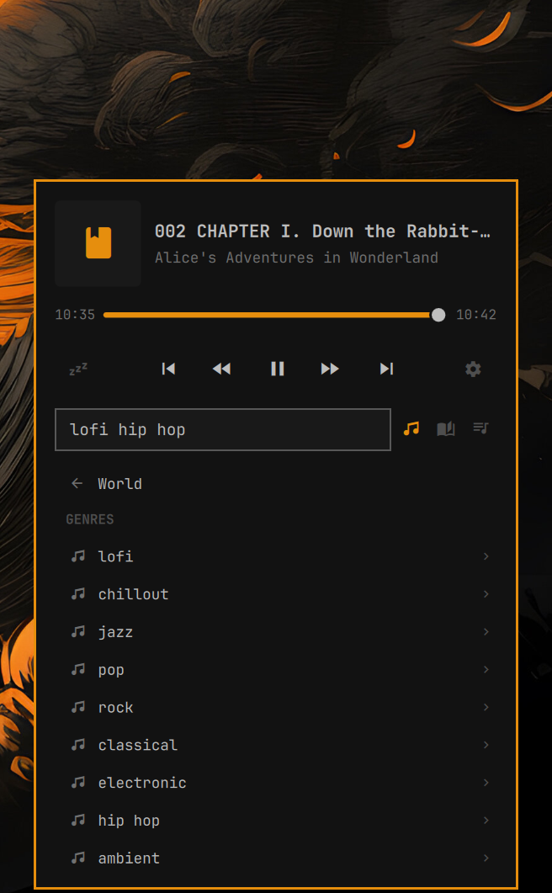
  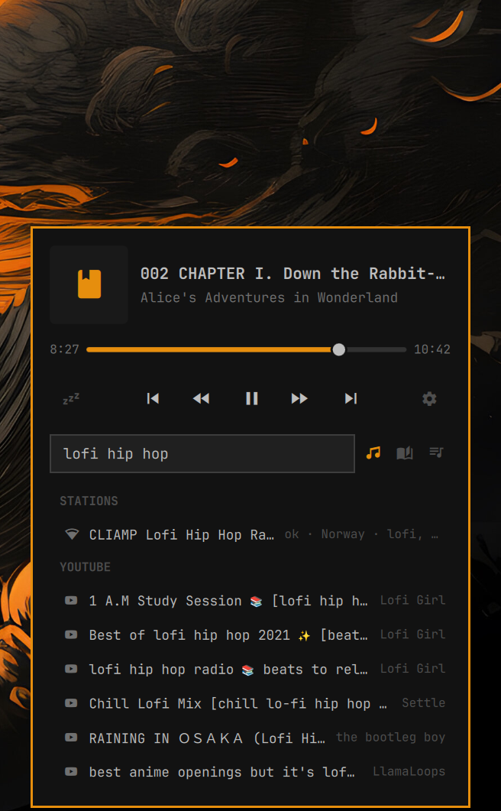
</p>

Search once and the box answers with both: stations from Radio Browser and
videos from YouTube. 󰐹 beside a station is its speed, tested in the
background and kept; the World page groups everything by genre and country,
and Discover tries a handful from different countries and keeps the fast ones.

<p align="center">
  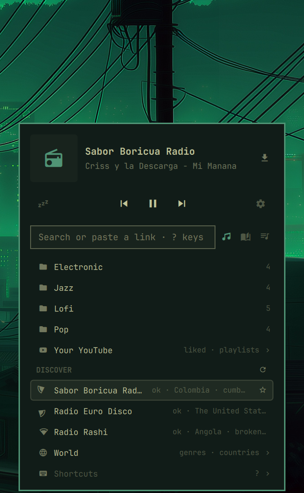
</p>

## The reader, closer up

<p align="center">
  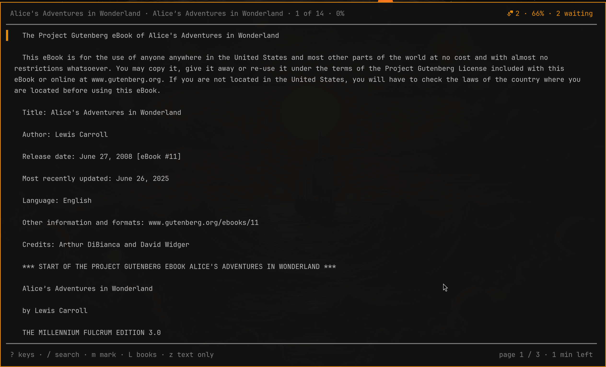
  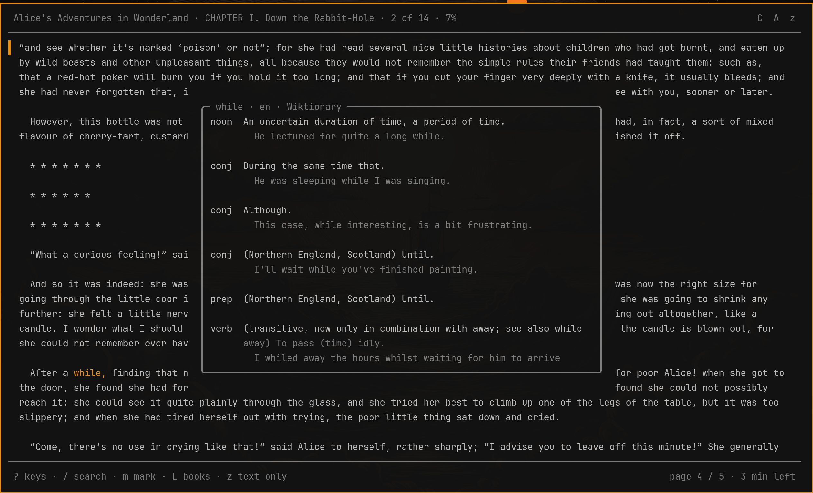
</p>

<p align="center">
  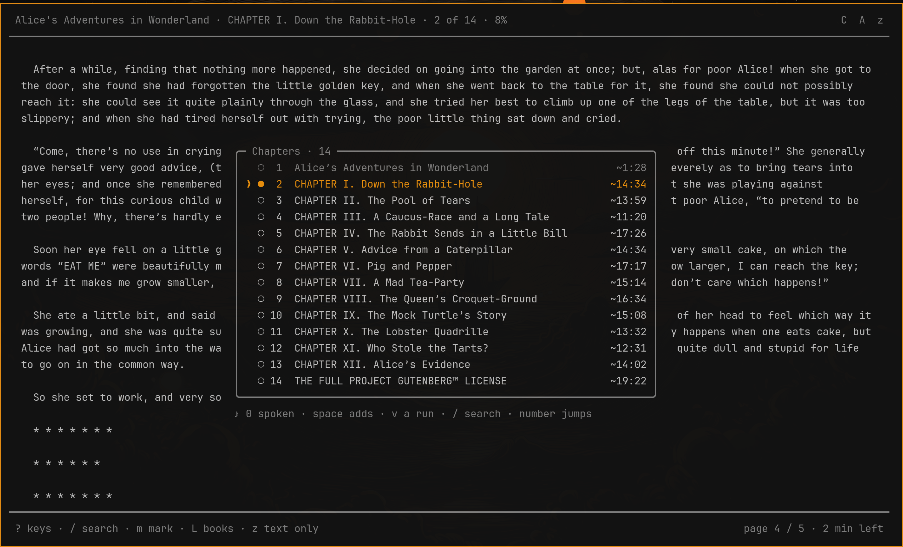
</p>

## How it works

`scripts/card.py` does all the work and answers in JSON; the QML only draws.
Status is pushed, not polled: `card.py watch` waits on MPD's `idle` and
prints a line when something changes (about 0.05% CPU, against about 4% for
the old once-a-second poll). A new search stops the previous one.
It talks to MPD over its socket, gets stations from
[Radio Browser](https://www.radio-browser.info/) (random server, identified
by user agent, clicks counted as the API asks), and uses `yt-dlp` for YouTube
search, playback and downloads.

- YouTube plays through a small **relay** inside the watcher. Since 2026
  YouTube throttles a stream request that has no byte range and then drops
  it (measured: a 2.7 MB song cut off after about a minute at 1.9 MB), and
  MPD opens streams exactly that way, so longer songs stopped partway. MPD
  now gets `http://127.0.0.1:<port>/yt/<video id>`; the relay asks YouTube
  for 1 MiB pieces in turn and passes them on (the same song arrived whole
  in 8 s). It listens on this machine only, serves nothing but
  `/yt/<video id>`, fetches nothing but the stream yt-dlp resolved for that
  video, and passes on no header from the caller. A link that expires
  mid-song is resolved again on the spot, so a queued song no longer goes
  stale. "Steady YouTube playback" in Settings turns it off (direct links,
  as before). Playlists start on the first song and the rest are added in
  the background.
- It mends two things that used to stop the music: a YouTube link that
  expired (they last a few hours, so a song queued or paused a while failed
  with HTTP 403) is replaced in place by a fresh one, and a radio station
  that drops is tried again, up to three times. Each song gets a couple of
  tries per ten minutes; a short plain note says what happened.
- The dancer's pop on each beat is two steps, not a smooth animation: a
  smooth one redraws the bar at the screen's refresh rate (on a 165 Hz
  laptop the shell went from 2% to 17% of a core with the dancer on; now
  3.8%).
- The setup check also warns when yt-dlp is more than 60 days old, the
  usual reason YouTube stops working.
- HLS (`.m3u8`) stations are skipped; MPD plays them unreliably.
- **Station speed**: every station list is tested and sorted. A station is
  opened, the first 32 KB (about two seconds of sound) read, and it hangs
  up: under 1.5 s is **fast**, under 3 s **ok**, more is **slow**, and an
  error, a web page or a playlist file is **not working**. Lists show
  straight away and re-sort once the test is done (about 10 s the first
  time, all stations at once). Results are kept 5 days (or 10: Settings →
  Keep radio lists and speed tests); a station that did not work gets
  another try after a day. Settings → Test radio speed now tests every
  kept station again in the background.
- **Kept lists**: the World page and each genre or country list are kept
  for the same 5 or 10 days, so opening one again is instant and already
  sorted ("Kept from …" at the top). ↻ there fetches a fresh list.
  Fast first, then ok, untested, slow, not working; within each, by
  Radio Browser votes. The row icon is a signal-strength bar. Measured on
  real stations, 2026-09-21: fast ones started in 1.0 s (median), ok in
  2.0 s, slow in 2.7 s, and one slow one never started.
- **Discover** tests a handful from different countries and shows only fast
  or ok ones (it stops as soon as three are found, about 2.5 s cold).
- **Next / previous on the radio**: playing a station from a list (Discover,
  Starred, a genre or country, search) queues the whole list in the order
  shown, leaving out stations known not to work, so next and previous move
  between stations from the card, the bar icon, the media keys or rmpc. The
  card's buttons follow the list order even with shuffle on.
  `omarchy-shell songbook next` / `previous` do the same, for a key binding. A station that
  fails moves on to the next one. Station names show in Up next.
- The speed test never opens an address inside this computer or the local
  network (a listing is written by strangers), checks redirects too, and
  a station with such an address is not played either.
- The list is built from plain data snapshots, debounced, never from live
  objects: Repeaters fed live lists are what crashed the shell before
  (Omarchy #11202, #11755).

State lives in `~/.local/state/rushi.songbook/`: stars, what to resume, YouTube
titles and resolved streams, the relay's port, download progress.

## What it accesses

Everything runs as you, inside the Omarchy shell. No sudo, no system
services, no binaries, nothing downloaded and run.

**Network**
- [LRCLIB](https://lrclib.net) (HTTPS): lyrics for the song playing, when
  the Lyrics view is open
- [Radio Browser](https://www.radio-browser.info/) API (HTTPS): station
  lists, and a play count per station you play, as the API asks
- the radio stations you choose (their own stream servers, often plain HTTP)
- the stations in a list you open, briefly (32 KB each), to test their speed
  (only public internet addresses)
- YouTube, through `yt-dlp`: search, audio streams, downloads
- YouTube's stream servers (`*.googlevideo.com`), from the relay, in 1 MiB
  pieces of the song playing
- `i.ytimg.com`: the thumbnail of the YouTube song playing
- `sponsor.ajay.app` (SponsorBlock), only when "cut talk and intros" is on:
  which parts of a video being downloaded are not music

**Listens**
- `127.0.0.1` only, on one port (kept in `relay.json`): the YouTube relay,
  for MPD

**Files it moves**
- music files from `~/Downloads` into your music folder, only when you choose
  a folder for them in the Inbox

**Files it writes**
- `mpd.conf`: only the `music_directory` line, only when you change the
  music folder in Settings and press Enter, with a dated backup
- your music folder: only songs you choose to download, and `Favorites/`
- MPD's playlist folder: the `Favorites` playlist, when you star a song
- `~/.local/state/rushi.songbook/`: stars, resume point, YouTube titles,
  download progress
- `~/.cache/rushi.songbook/art/`: album art, capped at 300 covers
- `~/.cache/rushi.songbook/lyrics/`: lyrics already looked up

**Files it reads**
- song lists and music files in `~/Downloads` from the last two weeks (names
  and sizes; a list is only read when you open it)
- `~/.config/mpd/mpd.conf`, and MPD's visualizer FIFO while the dancer is
  on screen
- only if you turn on YouTube sign-in: the chosen browser's cookie store,
  read by `yt-dlp` itself (`--cookies-from-browser`) each time it runs.
  Chromium-based browsers may ask to unlock the keyring the first time.

**Programs it starts**
- `python3` running `scripts/card.py` / `scripts/beat.py` from this folder
- `yt-dlp` (and through it `ffmpeg`) for YouTube
- `omarchy-launch-or-focus-tui rmpc` on right click (by default)
- `pactl subscribe`, inside the watcher, to notice headphones going away
- `notify-send` when song notifications are on
- `systemctl --user restart mpd` when you change the music folder

It never edits your Omarchy or Hyprland configuration, and edits MPD's only
as described above. Playing a folder,
station or YouTube link replaces MPD's current queue, as a player does.

Downloading from YouTube is your responsibility: only download what you are
allowed to.

## Dependencies

`mpd`, `python3` (standard library only), `yt-dlp`, `ffmpeg`; `rmpc` optional.
Station data comes from Radio Browser; YouTube access from `yt-dlp`.

## Changing it with an AI

Ask your AI to read `AGENTS.md` in this folder first. It explains how the
plugin is put together, the rules that keep it safe, and how to test a
change without touching your music or settings.

## Tests

`python3 tests/security_test.py` runs the security tests against a fake MPD and a
recorded `subprocess`; nothing real is touched except a read-only fuzz of the
search and folder commands.

After editing the QML, restart the shell (`omarchy-restart-shell`): the
hot reload keeps the old component cached.

## Settings

On the widget entry in `~/.config/omarchy/shell.json`:

| Key         | Default | Meaning                   |
|-------------|---------|---------------------------|
| `icon`      | 󰦚       | Bar glyph for music       |
| `radioIcon` | 󰐹       | Bar glyph for a station   |
| `youtubeIcon` | 󰗃     | Bar glyph for YouTube     |
| `bookIcon`  | 󰂺       | Bar glyph for an audiobook |

## Security

What it does to stay out of trouble, and how to report anything it does not:
[SECURITY.md](SECURITY.md). Reporters are credited in [CREDITS.md](CREDITS.md).

## Licence

MIT. See [LICENSE](LICENSE). In short: use it, change it, ship it, sell it —
keep the copyright notice, and it comes with no warranty.
